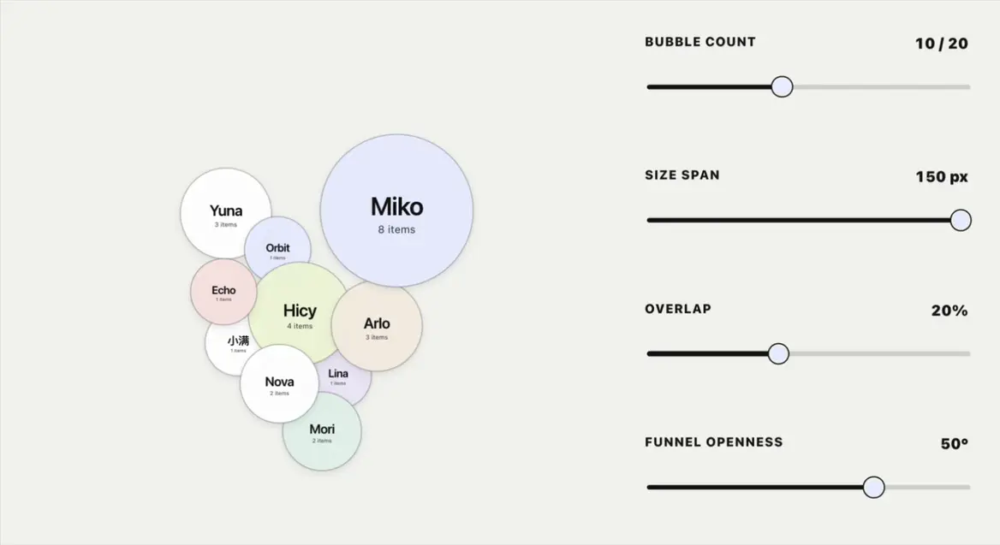
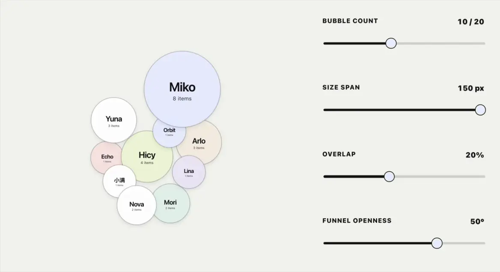
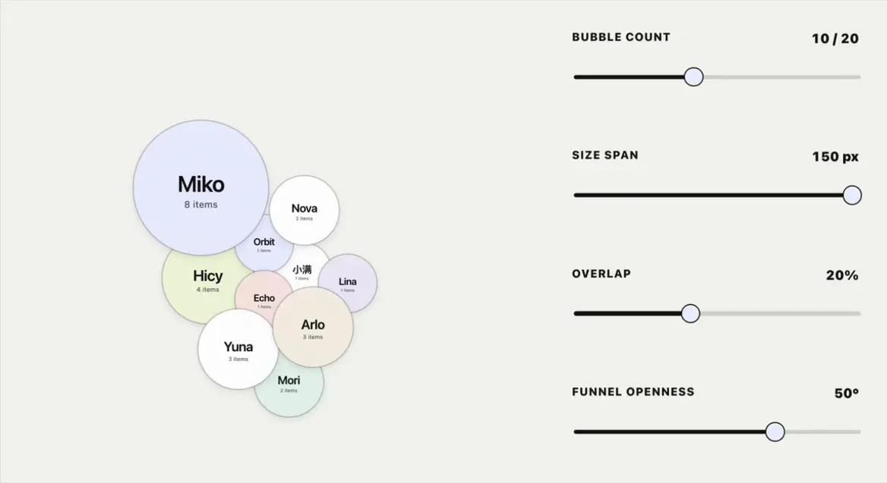

# Bubble Burst

**Live demo:** [https://hicywon.github.io/bubble-burst/](https://hicywon.github.io/bubble-burst/)

A data-driven bubble layout that drifts, collides, bursts, and calmly gathers itself back together.

Give each object a name and a number, and the number becomes its visual weight: larger values create larger bubbles and more prominent labels. Drag them, nudge them, pop them, and watch the little group make room, reflow, and grow back.



## What it does

- Generates bubbles from a simple name-and-value data set
- Scales bubble size, name size, value size, and label spacing together
- Lets bubbles drift inside an invisible funnel-shaped boundary
- Models collision, repulsion, and controlled overlap between bubbles
- Pushes nearby bubbles out of the way while dragging
- Recalculates a compact layout when values or parameters change
- Settles bubbles back into place with a soft spring motion
- Bursts a bubble into same-color particles, then grows it back
- Allows repeated bursts, reflows, and rebirths
- Lets you refresh the front-to-back layer order independently
- Adds new bubbles naturally when new objects enter the data set



## Where it fits

Bubble Burst is not tied to contribution scores. It is a small interactive visual layer for showing relative scale, activity, or quantity across a group of objects.

It can work well for:

- Team contribution, participation, or activity views
- Member directories, roles, and relationship walls
- Tags, keywords, content heat, or topic distribution
- Projects, tasks, resources, or inventory snapshots
- Live status, notification, or activity clusters
- Interactive data entry points on homepages and feature pages

Contribution ranking is one possible use case—not the whole personality of the component. It behaves less like a strict table and more like a tiny group of bubbles that negotiates space, occasionally gets dramatic, and then carries on.

## Tunable parameters

| Parameter | Range | Default | What it changes |
| --- | ---: | ---: | --- |
| Bubble count | 3–20 | 10 | Number of bubbles in the scene |
| Size span | 0–150px | 100px | Difference between the smallest and largest bubble |
| Overlap | 0–50% | 20% | How closely bubbles can gather and overlap |
| Funnel openness | 20–62° | 50° | How open the invisible boundary feels |

The bubble radius is the single source of truth for typography. When a bubble shrinks, its name, value, and the space between them shrink with it—no tiny bubble carrying an oversized sign.



## Interactions

- Drag a bubble: nearby bubbles make room; release it to reflow and settle
- Click a bubble: burst it into matching particles and let it grow back
- Regenerate layout: recalculate positions, collisions, and layers
- Refresh layer order: change only which bubbles sit in front
- Restore defaults: reset the parameters and regroup the layout

The previews above intentionally show combined behavior rather than isolated slider demos: dragging includes neighbor repulsion and release settling, resizing includes a fresh compact layout, and bursting includes particle motion plus the surrounding reflow and rebirth.

## Bring your own data

The component needs two values per object:

```js
[
  { author: 'Miko', itemCount: 8 },
  { author: 'Hicy', itemCount: 4 },
  { author: 'Yuna', itemCount: 3 }
]
```

In a real product, replace the demo array with your existing data source. Add an object and a new bubble appears; change its number and its bubble, labels, and layout weight update together. `itemCount` is only an example field name—it can represent tasks, views, mentions, inventory, activity, or any other numeric measure.

## Run it locally

This is a self-contained single-file demo. No build step or dependency install is required:

```bash
open index.html
```

It is also ready to serve from GitHub Pages.

## Files

```text
index.html                  # Openable demo
bubble-burst-v3.2.html      # Versioned copy of the demo
assets/                     # WebP previews used above
```

## Credits

Bubble Burst · V3.2 · Hicy
